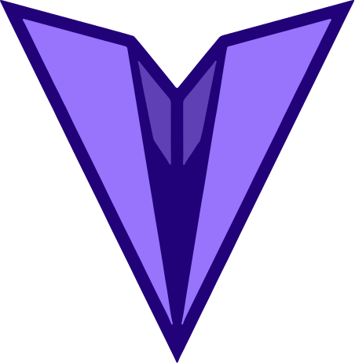

<p align="center">
  
</p>

<h1 align="center">MrDTwice</h1>

<p align="center">
  <strong>Scopri, condividi e vota luoghi interessanti da visitare.</strong>
</p>

<p align="center">
  MVP academy con frontend Angular, backend Express e database Supabase.
</p>

<p align="center">
  <a href="#documentazione">Documentazione</a>
  ·
  <a href="#percorsi-rapidi">Percorsi rapidi</a>
  ·
  <a href="#avvio-rapido">Avvio rapido</a>
  ·
  <a href="#licenza">Licenza</a>
</p>

<p align="center">
  
  
  
  
  
</p>

## Indice

- [Indice](#indice)
- [Documentazione](#documentazione)
- [Percorsi rapidi](#percorsi-rapidi)
- [Stack tecnologico](#stack-tecnologico)
- [Funzionalita' MVP](#funzionalita-mvp)
- [Avvio rapido](#avvio-rapido)
- [Struttura](#struttura)
- [Link esterni](#link-esterni)
- [Licenza](#licenza)
- [Contributors](#contributors)

## Documentazione

Questa repository e' organizzata come una piccola documentazione navigabile: il
README e' la porta d'ingresso, mentre i file in `docs/` sono capitoli collegati
tra loro.

- [Indice completo della documentazione](docs/README.md)
- [Concept del prodotto](docs/concept.md)
- [Architettura informativa e flussi](docs/information-architecture.md)
- [Stack tecnico](docs/technical-stack.md)
- [Guida setup locale](docs/setup-guide.md)
- [Flusso backend e API](docs/BE-schema-of-complete-flux.md)
- [Style guide](docs/style-guide.md)
- [Guida deployment](docs/deployment-guide.md)
- [Roadmap evolutiva](docs/roadmap.md)
- [README frontend](frontend/README.md)

## Percorsi rapidi

Per capire il progetto:

1. Parti dal [Concept](docs/concept.md).
2. Prosegui con [Architettura informativa e flussi](docs/information-architecture.md).
3. Consulta i [mockup](docs/mockups/) quando devi confrontare pagine e UI.
4. Leggi la [Roadmap evolutiva](docs/roadmap.md) per distinguere MVP e sviluppi futuri.

Per lavorare al codice:

1. Leggi lo [Stack tecnico](docs/technical-stack.md).
2. Segui la [Guida setup locale](docs/setup-guide.md).
3. Usa il [Flusso backend e API](docs/BE-schema-of-complete-flux.md) per allineare
   frontend, backend e database.
4. Applica la [Style guide](docs/style-guide.md) prima di consegnare modifiche.
5. Controlla build, variabili ambiente e checklist nella [Guida deployment](docs/deployment-guide.md).

## Stack tecnologico

| Area | Tecnologie |
|---|---|
| Frontend |    |
| Backend e dati |     |
| Tooling |     |

I dettagli tecnici e lo stato delle integrazioni sono raccolti nello
[Stack tecnico](docs/technical-stack.md).

## Funzionalita' MVP

- Esplorare luoghi.
- Cercare e filtrare per regione, citta', categoria o tag.
- Aprire la scheda dettaglio di un luogo.
- Aggiungere un nuovo luogo con informazioni base e immagine.
- Caricare immagini su Supabase Storage.
- Esprimere apprezzamento sui luoghi tramite like e dislike.

Fuori scope per la prima versione:

- Autenticazione.
- Profili utente.
- Preferiti e wishlist.
- Funzionalita' social avanzate.
- Moderazione complessa.
- Raccomandazioni automatiche.
- Test automatizzati.

## Avvio rapido

Frontend:

```bash
cd frontend
npm install
npm start
```

Backend:

```bash
cd backend
npm install
npm start
```

Entrambe le applicazioni richiedono una versione Node.js supportata da Angular 21;
il progetto indica Node 24 in `.nvmrc`. Il backend richiede inoltre un file `.env`
con le variabili database e Supabase Storage descritte nella
[Guida setup locale](docs/setup-guide.md).

## Struttura

```text
.
|-- backend/       # API Express, connessione database e service
|-- docs/          # Documentazione navigabile e mockup
|-- frontend/      # Applicazione Angular
|-- LICENSE
`-- README.md
```

## Link esterni

- [Figma mockup](https://www.figma.com/design/cMAgFuT1NFTkabQaFxcSP8/Wireframe-e-Mockup?node-id=30-54384&t=sUAnXCBUrnGCNY4F-1)

## Licenza

Distribuito con licenza [MIT](LICENSE).

## Contributors

Le persone che hanno contribuito al progetto:

<p align="center">
  <a href="https://github.com/ricpastori">
    
  </a>
  <a href="https://github.com/Davide-Donnarumma">
    
  </a>
  <a href="https://github.com/Dade1991">
    
  </a>
  <a href="https://github.com/Marienne-ma">
    
  </a>
</p>

<p align="center">
  <a href="https://github.com/ricpastori">Riccardo Pastori</a>
  ·
  <a href="https://github.com/Davide-Donnarumma">Davide Donnarumma</a>
  ·
  <a href="https://github.com/Dade1991">Dade1991</a>
  ·
  <a href="https://github.com/Marienne-ma">Marienne-ma</a>
</p>
