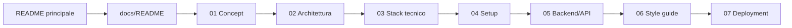

# Documentazione MrDTwice

[<- README principale](../README.md)

Questa cartella funziona come documentazione navigabile del progetto. Ogni file e'
un capitolo, collegato al precedente, al successivo e all'indice.

## Percorso consigliato

1. [Concept](concept.md) - per capire prodotto, scope e criteri di successo.
2. [Architettura informativa e flussi](information-architecture.md) - per collegare
   pagine, mockup e azioni utente.
3. [Stack tecnico](technical-stack.md) - per sapere quali tecnologie sono in gioco.
4. [Setup locale](setup-guide.md) - per installare e avviare frontend/backend.
5. [Flusso backend e API](BE-schema-of-complete-flux.md) - per allineare dati,
   endpoint e responsabilita'.
6. [Style guide](style-guide.md) - per mantenere coerente il codice.
7. [Deployment](deployment-guide.md) - per preparare pubblicazione e demo.

## Mappa documentazione

## Risorse visive

I mockup sono in [docs/mockups](mockups/) e sono collegati dal capitolo
[Architettura informativa e flussi](information-architecture.md).

File disponibili:

- `homepage.png`
- `regions.png`
- `region_details.png`
- `regions+tag.png`
- `place_details.png`
- `add_place_1.png`
- `add_place_2.png`
- `about.png`
- `404_not_found.png`

## Stato e manutenzione

- La documentazione distingue sempre tra stato attuale e target MVP.
- Quando cambia una route, aggiorna prima [Architettura informativa](information-architecture.md)
  e poi [Flusso backend e API](BE-schema-of-complete-flux.md).
- Quando cambia uno script, una dipendenza o un servizio, aggiorna
  [Stack tecnico](technical-stack.md) e [Setup locale](setup-guide.md).
- Quando cambia una regola di naming o qualita', aggiorna [Style guide](style-guide.md).
