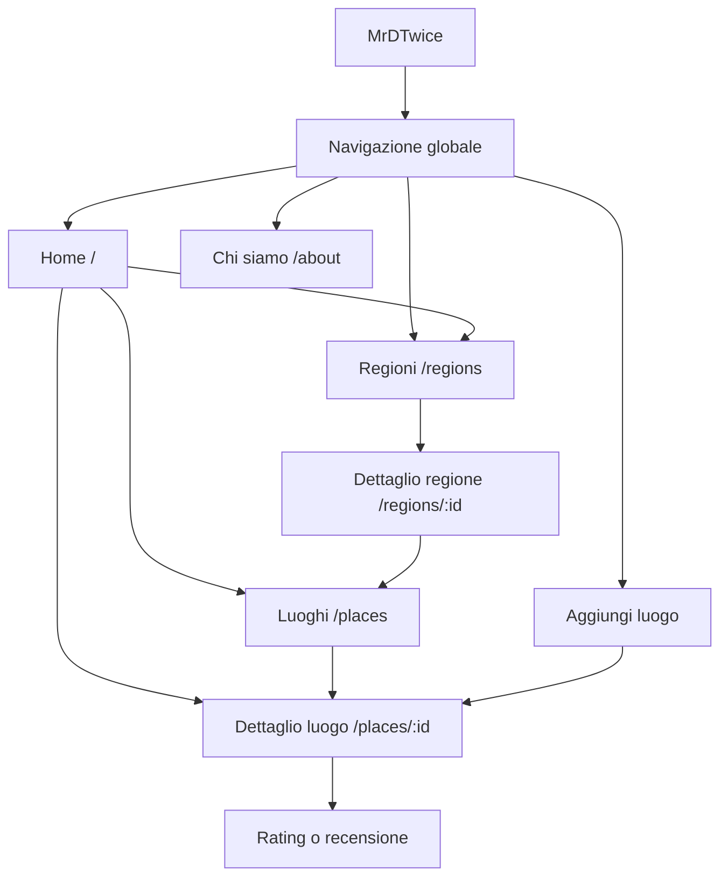
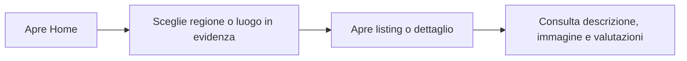
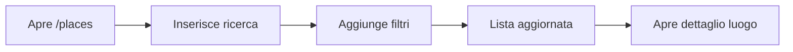
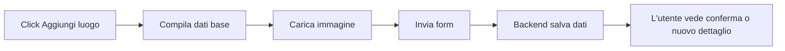
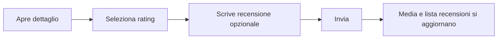

# 02 - Architettura informativa e flussi

[<- Concept](concept.md) | [Indice docs](README.md) | [Prossimo: Stack tecnico ->](technical-stack.md)

Questo capitolo traduce il concept in struttura dell'app: pagine previste,
contenuti, navigazione e flussi principali.

## Stato corrente

Il frontend Angular e' ancora allo scaffold iniziale:

- `frontend/src/app/app.routes.ts` espone un array route vuoto.
- `frontend/src/app/app.html` contiene ancora il template di benvenuto Angular.
- I mockup sono salvati in `docs/mockups/` e rappresentano la direzione UI.

La mappa seguente descrive quindi l'architettura target dell'MVP, non lo stato gia'
implementato al 100%.

## Mappa navigazione target

## Pagine principali

| Pagina | Route target | Scopo | Mockup collegato |
|---|---|---|---|
| Home | `/` | Introduce il progetto, mette in evidenza regioni e luoghi. | `docs/mockups/homepage.png` |
| Regioni | `/regions` | Mostra le regioni esplorabili. | `docs/mockups/regions.png` |
| Dettaglio regione | `/regions/:id` | Presenta luoghi e categorie di una regione. | `docs/mockups/region_details.png` |
| Listing luoghi | `/places` | Lista filtrabile per ricerca, regione, tag e sottotag. | `docs/mockups/regions+tag.png` |
| Dettaglio luogo | `/places/:id` | Scheda completa del luogo selezionato. | `docs/mockups/place_details.png` |
| Chi siamo | `/about` | Racconta progetto, tono e obiettivo. | `docs/mockups/about.png` |
| 404 | fallback | Gestisce percorsi non validi. | `docs/mockups/404_not_found.png` |
| Aggiungi luogo | azione/modal | Raccoglie i dati di un nuovo luogo. | `docs/mockups/add_place_1.png`, `docs/mockups/add_place_2.png` |

## Struttura contenuti

```mermaid
flowchart TD
  Home --> Hero["Hero con ricerca o CTA"]
  Home --> Highlights["Regioni o luoghi in evidenza"]
  Home --> Recent["Contributi recenti"]

  Regions --> RegionGrid["Griglia regioni"]
  RegionDetail --> RegionHero["Hero regione"]
  RegionDetail --> TagSections["Sezioni per categoria/tag"]

  Places --> Search["Ricerca testuale"]
  Places --> Filters["Filtri regione, citta', tag, sottotag"]
  Places --> Cards["Card luogo"]

  Detail --> Image["Immagine principale"]
  Detail --> Metadata["Regione, citta', categoria"]
  Detail --> Description["Descrizione"]
  Detail --> Rating["Rating medio e recensioni"]

  AddPlace --> Required["Campi obbligatori"]
  AddPlace --> Upload["Upload immagine"]
  AddPlace --> Submit["Salvataggio"]
```

## Flussi utente

### Esplorazione da home

### Ricerca e filtri

### Aggiunta luogo

### Rating o recensione

## Dati minimi per una card luogo

| Campo | Uso UI |
|---|---|
| `id` | Link al dettaglio. |
| `place` o `title` | Titolo della card. |
| `city` | Localizzazione leggibile. |
| `region_id` o regione risolta | Filtro e breadcrumb. |
| `tag_id` o tag risolto | Categoria principale. |
| `image_url` | Immagine card e detail. |
| `average_rating` | Indicatore qualita'. |

## Decisioni di navigazione

- La navigazione deve restare comprensibile anche senza login.
- Il form di inserimento puo' essere una pagina o una modale; deve essere accessibile
  dalla navigazione globale.
- Il dettaglio luogo e' la destinazione principale di card, ricerca e filtri.
- I link legali possono restare placeholder per l'MVP se non bloccano la demo.

## Prossima lettura

Vai allo [Stack tecnico](technical-stack.md) per collegare questa architettura a
framework, database, API e strumenti di sviluppo.
