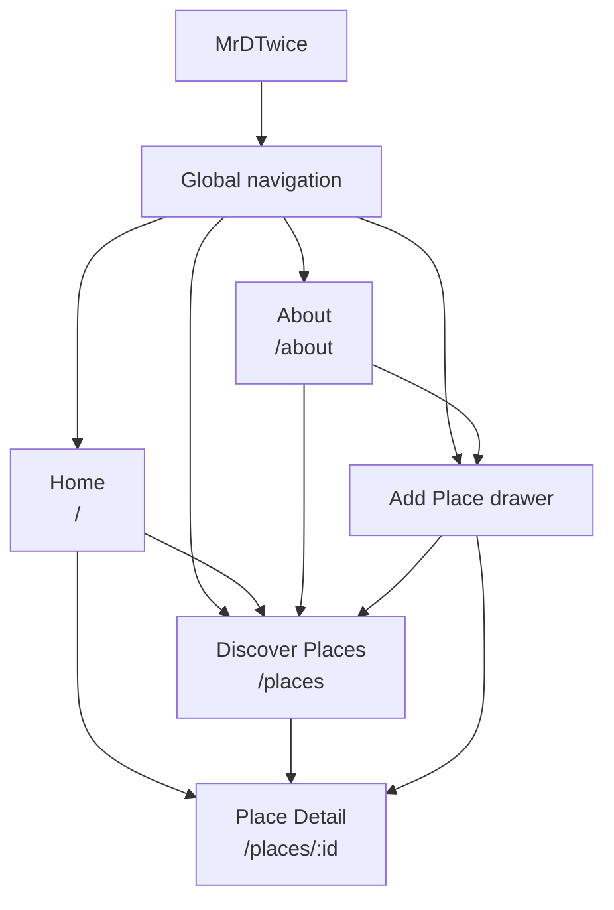
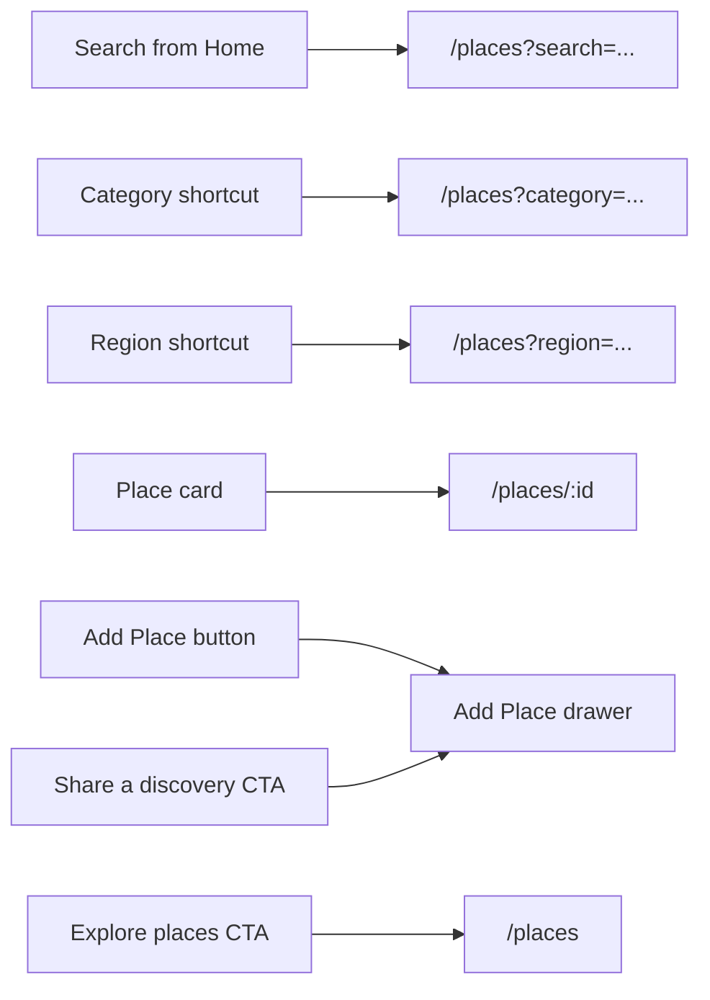
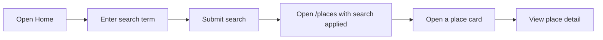
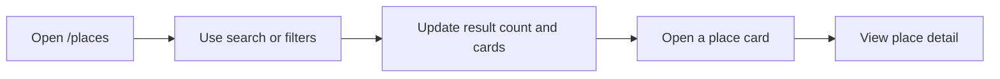
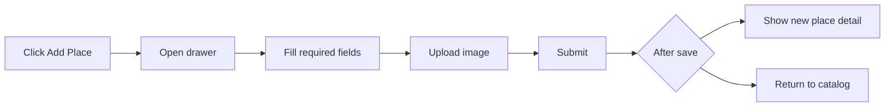
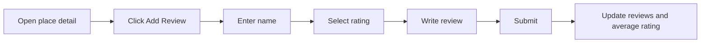
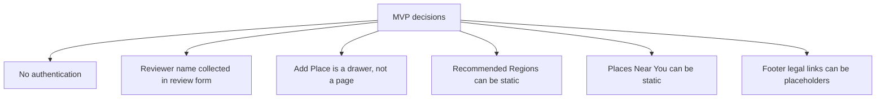

# Information Architecture and User Flows

## Sitemap

## Page Structure

```mermaid
flowchart TD
  Home["Home /"] --> HomeHero["Hero with search"]
  Home --> HomeCategories["Category shortcuts"]
  Home --> HomeRegions["Recommended Regions"]
  Home --> HomeNear["Places Near You"]
  Home --> HomeTop["Top Rated Places"]

  Places["Discover Places /places"] --> PlacesSearch["Text search"]
  Places --> PlacesFilters["Country, region, category filters"]
  Places --> PlacesCount["Result count"]
  Places --> PlacesGrid["Place card grid"]

  Detail["Place Detail /places/:id"] --> DetailBreadcrumb["Breadcrumb"]
  Detail --> DetailImage["Main image"]
  Detail --> DetailHeader["Title, category, location"]
  Detail --> DetailRating["Rating summary"]
  Detail --> DetailAbout["About text"]
  Detail --> DetailInfo["Details card"]
  Detail --> DetailReviews["Reviews list"]
  Detail --> DetailReviewForm["Add Review form"]

  About["About /about"] --> AboutHero["Story hero"]
  About --> AboutIntro["Intro text"]
  About --> AboutStats["Stats"]
  About --> AboutPlaces["Inspirational places"]
  About --> AboutPrinciples["Project principles"]
  About --> AboutCta["Final CTA"]

  AddPlace["Add Place drawer"] --> AddTitle["Title"]
  AddPlace --> AddDescription["Description"]
  AddPlace --> AddCategory["Category"]
  AddPlace --> AddLocation["Country, region, city"]
  AddPlace --> AddImage["Image upload"]
```

## Main Actions

## User Flows

### Search and Discover

### Browse Catalog

### Add a Place

### Add a Review

## MVP Decisions

