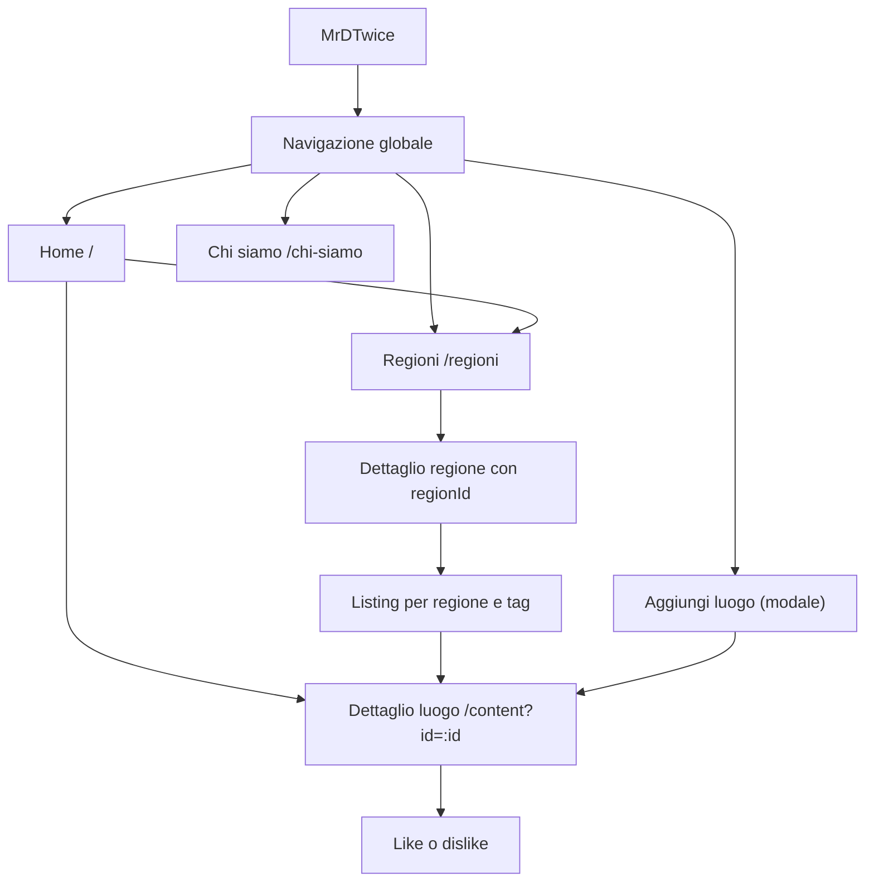
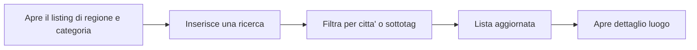
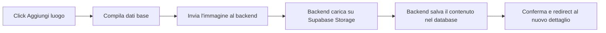
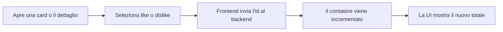

# 02 - Architettura informativa e flussi

[<- Concept](concept.md) | [Indice docs](README.md) | [Prossimo: Stack tecnico ->](technical-stack.md)

Questo capitolo traduce il concept in struttura dell'app: pagine previste,
contenuti, navigazione e flussi principali.

## Stato corrente

Il frontend Angular implementa home, regioni, dettaglio regione, listing filtrato,
dettaglio luogo, pagina informativa, modale di inserimento e fallback 404. Le route
usano path in italiano e query parameter per identificare regione, tag e contenuto.
I mockup in `docs/mockups/` restano il riferimento visuale del progetto.

## Mappa navigazione attuale

## Pagine principali

| Pagina | Route target | Scopo | Mockup collegato |
|---|---|---|---|
| Home | `/` | Introduce il progetto e mostra regioni e luoghi in evidenza. | `docs/mockups/homepage.png` |
| Regioni | `/regioni` | Mostra le regioni esplorabili. | `docs/mockups/regions.png` |
| Dettaglio regione | `/regioni/regione-dettaglio?regionId=:id` | Presenta categorie e luoghi di una regione. | `docs/mockups/region_details.png` |
| Listing luoghi | `/regioni/regione-dettaglio/regione-tags?regionId=:regionId&tagId=:tagId` | Lista filtrabile per testo, citta' e sottotag. | `docs/mockups/regions+tag.png` |
| Dettaglio luogo | `/content?id=:id` | Scheda completa del luogo selezionato. | `docs/mockups/place_details.png` |
| Chi siamo | `/chi-siamo` | Racconta progetto, tono e obiettivo. | `docs/mockups/about.png` |
| 404 | fallback | Gestisce percorsi non validi. | `docs/mockups/404_not_found.png` |
| Aggiungi luogo | modale globale | Raccoglie dati e immagine del nuovo luogo. | `docs/mockups/add_place_1.png`, `docs/mockups/add_place_2.png` |

## Struttura contenuti

```mermaid
flowchart TD
  Home --> Hero["Hero con ricerca o CTA"]
  Home --> Highlights["Regioni o luoghi in evidenza"]
  Home --> Recent["Contributi recenti"]

  Regions --> RegionGrid["Griglia regioni"]
  RegionDetail --> RegionHero["Hero regione"]
  RegionDetail --> TagSections["Sezioni per categoria/tag"]

  Places --> Search["Ricerca testuale"]
  Places --> Filters["Filtri citta' e sottotag"]
  Places --> Cards["Card luogo"]

  Detail --> Image["Immagine principale"]
  Detail --> Metadata["Regione, citta', categoria"]
  Detail --> Description["Descrizione"]
  Detail --> Feedback["Like e dislike"]

  AddPlace --> Required["Campi obbligatori"]
  AddPlace --> Upload["Upload immagine"]
  AddPlace --> Submit["Salvataggio"]
```

## Flussi utente

### Esplorazione da home

### Ricerca e filtri

### Aggiunta luogo

### Like o dislike

## Dati minimi per una card luogo

| Campo | Uso UI |
|---|---|
| `id` | Link al dettaglio. |
| `place` o `title` | Titolo della card. |
| `city` | Localizzazione leggibile. |
| `region_id` o regione risolta | Filtro e breadcrumb. |
| `tag_id` o tag risolto | Categoria principale. |
| `image_url` | Immagine card e detail. |
| `likes`, `dislikes` | Indicatori di gradimento. |

## Decisioni di navigazione

- La navigazione deve restare comprensibile anche senza login.
- Il form di inserimento puo' essere una pagina o una modale; deve essere accessibile
  dalla navigazione globale.
- Il dettaglio luogo e' la destinazione principale di card, ricerca e filtri.
- I link legali possono restare placeholder per l'MVP se non bloccano la demo.

## Prossima lettura

Vai allo [Stack tecnico](technical-stack.md) per collegare questa architettura a
framework, database, API e strumenti di sviluppo.
