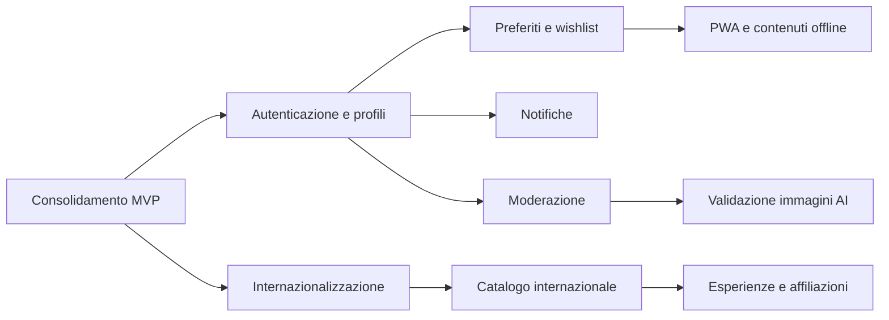

# 08 - Roadmap evolutiva

[<- Deployment](deployment-guide.md) | [Indice docs](README.md) | [README principale ->](../README.md)

Questa roadmap raccoglie le evoluzioni possibili dopo l'MVP. Non rappresenta un
calendario di rilascio: l'ordine indica dipendenze e valore atteso, mentre date,
responsabili e stime vanno definiti nella board di progetto quando un'iniziativa
entra davvero in lavorazione.

## Punto di partenza

L'MVP offre un catalogo pubblico senza autenticazione, navigazione per regioni e
categorie, dettaglio dei luoghi, inserimento con immagine e like/dislike. Prima di
ampliare il prodotto conviene consolidare questa base:

- l'accessibilita' ha gia' ricevuto interventi dedicati, ma va verificata a ogni
  evoluzione invece di essere considerata conclusa una volta per tutte;
- il repository contiene test automatici, ma una futura strategia di qualita'
  dovra' renderli affidabili e affiancarli con test di integrazione ed end-to-end;
- configurazione runtime, sicurezza e osservabilita' vanno completate prima di un
  utilizzo pubblico con account e contenuti su scala maggiore.

## Ordine di priorita'

| Fase | Obiettivo | Risultato atteso |
|---|---|---|
| 0. Consolidamento | Rendere l'MVP distribuibile e manutenibile. | Deploy ripetibile, configurazione sicura e controlli di qualita' stabili. |
| 1. Identita' e fiducia | Introdurre account, ownership e moderazione. | Community identificabile e contenuti amministrabili. |
| 2. Coinvolgimento | Aggiungere salvataggi, notifiche e fruizione mobile. | Utenti che possono tornare ai propri luoghi e ricevere aggiornamenti utili. |
| 3. Espansione | Preparare lingua inglese e catalogo internazionale. | Modello geografico e interfaccia adatti a piu' paesi. |
| 4. Automazione e business | Valutare AI e affiliazioni su una base gia' stabile. | Controlli media assistiti e primi esperimenti di sostenibilita' economica. |

## Fase 0 - Consolidamento dell'MVP

### Distribuzione e configurazione

- Spostare gli URL API frontend in configurazione ambiente.
- Leggere la porta backend dall'ambiente e limitare CORS ai domini autorizzati.
- Definire provider, ambienti, logging, monitoraggio e procedura di rollback.
- Automatizzare build, lint e controlli di formato nella pipeline di consegna.

### Qualita' e accessibilita'

- Stabilizzare i test unitari esistenti e aggiungere test di integrazione API.
- Coprire con test end-to-end i flussi esplorazione, inserimento e feedback.
- Integrare controlli automatici di accessibilita' e mantenere verifiche manuali
  per tastiera, screen reader, focus, contrasto e zoom.
- Verificare periodicamente il prodotto rispetto al livello WCAG AA scelto dal team,
  senza dichiarare conformita' completa in assenza di un audit formale.

### Debito tecnico

- Rimuovere i template backend `ItemsDaModificare.*` quando non servono piu'.
- Centralizzare contratti API, gestione degli errori e validazione degli input.
- Definire policy di sicurezza per upload, rate limiting e contenuti HTML.

## Fase 1 - Identita' e fiducia

### Autenticazione e profili

- Implementare registrazione, login, logout e recupero accesso.
- Collegare i contenuti al relativo autore e introdurre autorizzazioni lato backend.
- Offrire un profilo personale con contributi e preferenze essenziali.
- Definire privacy, conservazione dati e cancellazione dell'account prima del rilascio.

### Moderazione

- Introdurre stati come bozza, in revisione, pubblicato e rifiutato.
- Creare una coda di moderazione con approvazione, rifiuto e rimozione contenuti.
- Registrare le azioni amministrative e prevedere un flusso di segnalazione.
- Separare chiaramente permessi utente e amministratore.

## Fase 2 - Coinvolgimento e mobile

### Preferiti e wishlist

- Permettere agli utenti autenticati di salvare e organizzare i luoghi.
- Sincronizzare le raccolte tra dispositivi e renderle disponibili dal profilo.
- Misurare utilizzo e ritorno degli utenti prima di introdurre meccaniche sociali piu'
  complesse.

### Notifiche e PWA

- Definire eventi realmente utili prima di attivare notifiche in-app o push.
- Rendere l'app installabile con manifest e service worker.
- Progettare una modalita' offline limitata ai contenuti salvati, dichiarando sempre
  quando i dati potrebbero non essere aggiornati.
- Gestire consenso, revoca e frequenza delle notifiche.

## Fase 3 - Internazionalizzazione ed espansione

### Interfaccia multilingua

- Estrarre le stringhe dell'interfaccia e introdurre la localizzazione in inglese.
- Gestire locale, formati, metadati SEO e URL senza duplicare contenuti.
- Prevedere un processo editoriale per traduzioni e aggiornamenti.

### Catalogo internazionale

- Generalizzare il modello geografico oltre le regioni italiane, includendo paese e
  livelli amministrativi configurabili.
- Adeguare ricerca, filtri, seed e API al nuovo modello dati.
- Validare l'espansione su un numero ristretto di paesi prima di estenderla globalmente.

## Fase 4 - Automazione e modello di business

### Validazione immagini assistita da AI

- Valutare servizi di computer vision per rilevare immagini sfocate, non pertinenti
  o potenzialmente inappropriate.
- Mantenere revisione umana e possibilita' di ricorso: il modello non deve decidere
  autonomamente la pubblicazione finale.
- Verificare costi, privacy, tempi di risposta e falsi positivi prima dell'integrazione.

### Esperienze e affiliazioni

- Sperimentare una sezione dedicata a guide, strutture, ristorazione o prenotazioni.
- Distinguere in modo evidente contenuti editoriali, sponsorizzati e affiliati.
- Definire metriche, accordi commerciali, aspetti fiscali e responsabilita' legali.
- Validare prima la domanda con un esperimento limitato, evitando di costruire una
  piattaforma di prenotazione completa senza evidenze d'uso.

## Dipendenze principali

## Quando un'iniziativa e' pronta

Prima di trasformare una voce della roadmap in task, vanno chiariti almeno:

1. problema utente e risultato misurabile;
2. perimetro minimo e funzionalita' esplicitamente escluse;
3. impatto su dati, API, accessibilita', sicurezza e privacy;
4. dipendenze tecniche e operative;
5. piano di verifica, rilascio graduale e rollback.

La board operativa resta il posto corretto per checkbox, assegnatari e scadenze;
questo documento conserva invece direzione, ordine e motivazione delle evoluzioni.
